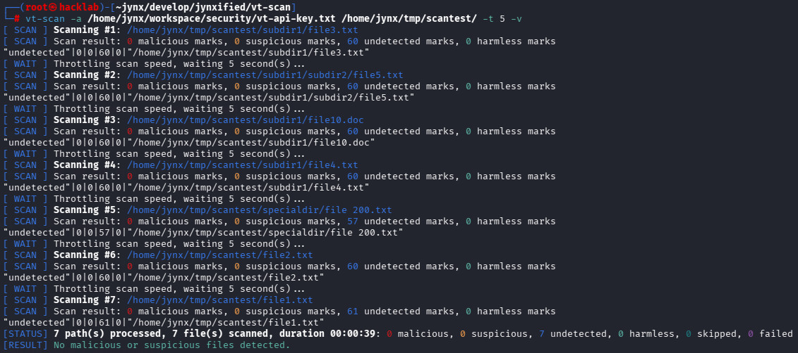

```
                         _                              
                        | |                             
                  __   _| |_ ______ ___  ___ __ _ _ __  
                  \ \ / / __|______/ __|/ __/ _` | '_ \ 
                   \ V /| |_       \__ \ (_| (_| | | | |
                    \_/  \__|      |___/\___\__,_|_| |_|

                      ::: Version 1.0.0 | @Jynx :::
               
 Mail_                 GitHub_                        BLOG_
 jynxified@proton.me | https://github.com/jynxified | https://jynxified.wordpress.com

```

# ## vt-scan
**vt-scan** is a Bash script designed to easily check individual files or entire directories for malware using the **VirusTotal web API**.

In case you are scratching your head wondering, "What on earth is VirusTotal?", it begs the question of why you are reading this README in the first place. But hey, don't worry, I'm here to help.

First off, this deeply informative link might already do the trick: [https://en.wikipedia.org/wiki/VirusTotal](https://en.wikipedia.org/wiki/VirusTotal)

However, if you happen to be one of them lazy people (like me) who refuse to click links and prefer reading pre-packaged, concise descriptions instead, you’re still in luck. Here's what you want:

[VirusTotal](https://www.virustotal.com/gui/home/upload) is a free online service that analyzes suspicious files and URLs to detect malware, viruses, and other security threats. It aggregates dozens of leading antivirus engines and website scanners to give you a quick, comprehensive security verdict on any file you feed it.

The cool thing about all of this is that VirusTotal provides a web API. And that’s exactly where this nifty script whose README you are currently reading comes into play: It simplifies using this API, allowing you to... well, go re-read the very first sentence at the top. Now it all makes sense, right?

Here's how an exemplary run of **vt-scan** looks like:



## ## Features

- **Foolproof:** Easy and intuitive to use (really).
- **Almost feels like cheating:** Supports wildcards and directory paths, allowing you to scan multiple files all at once without the need of specifying them one by one.
- **Slow down, cowboy:** Includes built-in request throttling to artificially delay scans, helping you stay safely within VirusTotal’s daily or per-minute API caps. (Yes, there are limits! See [here](https://docs.virustotal.com/reference/public-vs-premium-api) for more information.)
- **That comes in handy:** Outputs data in CSV format, making it effortless to parse and process.

## ## Prerequisites

To use the VirusTotal web API—and by extension, this script—you’ll need a VirusTotal account. You can create one right here:

[https://www.virustotal.com/gui/join-us](https://www.virustotal.com/gui/join-us)

VirusTotal distinguishes between free ("public") and paid ("premium") accounts. The main difference between the two is, first and foremost, that one is free and the other isn't. Mind-blowing, I know. Other than that, they mostly differ in the number of requests you can send per time frame, plus a few other gimmicks I won't bother listing here, because VirusTotal's own site does a much better job doing that.

Either way, you'll need to create such an account to use **vt-scan**. So go ahead and do it right now—that's one less thing to worry about.

Small pro-tip on the side: Even though the VirusTotal sign-up page insists on a first and last name, that might—just possibly—not mean you actually have to type in your real, legal name. Just a thought. I, of course, used my real name. Pinky swear!

Once you have an account, you can generate an API key. Why? Because you need one, that's why! Here's a exceptionally good—because extremely brief—guide on how to do that:

[https://docs.virustotal.com/docs/please-give-me-an-api-key](https://docs.virustotal.com/docs/please-give-me-an-api-key)

Please copy your newly created API key and save it to a file of your choice, wherever you like.

And that’s pretty much it!

**vt-scan** is now ready for action and eagerly waiting for all the digital junk you want to scan.

## ## Installation

Clone the repository and navigate into the project directory:

```bash
git clone https://github.com/jynxified/vt-scan.git
cd vt-scan
```
Make the script executable:
```bash
chmod +x vt-scan.sh
```

And that's it. I told you: it's so easy a fool could do it. And I'm a person of my word.

## ## Usage

```
vt-scan OPTIONS PATH|PATTERN [PATH|PATTERN ...]
```

### Paths & Patterns

**vt-scan** requires at least one file or directory path to get started. You can use wildcards (*) and provide as many paths as you like — they'll all be scanned one after the other. That's precisely what "`PATH|PATTERN`" stands for: use either a fully qualified path to a file or directory ("`PATH`") or a path that contains wildcards ("`PATTERN`"). You can also mix the two and specify both paths and patterns interchangeably. There are almost no limits to your imagination.

Example:

```
vt-scan ./file1.txt ./somedir/ ./otherdir/*.txt
```

### Options

#### Specifying VirusTotal API key file

```
-a, --apikey FILE
```

Use this option to specify the path and name of the file containing your VirusTotal API key. You don't remember what that means? Then please go back and check the "Prerequisites" section—everything you need to know about this issue is right there.

This option is **mandatory**. This means you don't have a choice: you must specifiy it for every single call of **vt-scan**. Sorry, but that's the way it goes.

Example:

```
vt-scan -a ./myAPIkey.txt ./somedir/*.txt
```

#### Throttling VirusTotal scan requests

```
-t, --throttle SECONDS
```

Use this option to specify a delay in seconds between consecutive VirusTotal queries. Depending on your VirusTotal account type (free or paid, remember?), only a certain number of requests are allowed per time frame (4 per minute and 500 per day for free accounts).

This option is **optional**, i.e. you can use it but you don't have to. If you omit it, the default value of 0 will be used, which, usurprisingly, means no delay whatsoever, scan requests will run immediately one after another.

Example:

```
vt-scan -a ./myAPIkey.txt -t 3 ./somedir/*.txt
```

#### Specifying report grace period

```
-g, --grace ATTEMPTS
```

Okay, I need to get a bit technical to explain this option. 

To optimize performance, VirusTotal does not rescan previously uploaded files. If a file is already known to VirusTotal, it immediately returns the initial scan results (referred to as the "Report").

However, if a file is new to VirusTotal, running a full scan and generating the corresponding report takes some time. **vt-scan** handles this by waiting for a configurable duration (the "Grace Period") to check if the report for a newly uploaded file becomes available.

This is where this option comes into play. It defines the number of attempts **vt-scan** should try to retrieve the report for a newly uploaded file from VirusTotal. There is a fixed 10-second pause between each attempt. If the report is still not available after these attempts, the file is skipped with a corresponding note.

This option is **optional**, i.e. you can use it but you don't have to. If you omit it, the default value of 5 will be used, which means that **vt-scan** will perform 5 attempts to get a file's report.

Example:

```
vt-scan -a ./myAPIkey.txt -g 10 ./evilFile.exe
```

Another pro tip: Avoid setting this value too low. A full scan takes a bit of time—usually about 15 to 20 seconds depending on how big the file is.

#### Limiting directory scan depth

```
-m, --maxdepth DEPTH
```

As mentioned above, if a directory path is provided, **vt-scan** will search that directory and its subdirectories for files. This particular option limits the maximum directory depth to be searched. Or, in less tech-heavy terms: depending on the set value, **vt-scan** searches up to that many levels of subdirectories.

This option is **optional**, which, again, means that you can use it but you don't have to. If you omit it, the default value of 10 will be used, which means that **vt-scan** will scan up to 10 subdirectories. The lowest allowed value is 0, in this case, only the root directory is searched, and all subdirectories are skipped.

If you pass a direct file path, this option is ignored.

Example:

```
vt-scan -a ./myAPIkey.txt -m 7 ./somedir/
```

#### Activating Debug mode

```
-v, --verbose
```

Normally, **vt-scan** outputs a compact summary of the VirusTotal results as a CSV-formatted line for each scanned file. I'll go into more detail on this in the next section.

Anyway, the point here is: if you want the script to output more information than just this CSV line—such as the specific requests being sent or their results—this option lets you enable debug mode, which is significantly more "talkative".

Just give the option a try, or keep reading to the next section. It's up to you!

Obviously, this option is **optional**. (That's a really funny sentence. Feel free to try saying it three times fast. And if you actually end up doing that: please seek professional help!)

Example:

```
vt-scan -a ./myAPIkey.txt -v ./iSwearImNotMalware.bin
```

#### Activating Trace mode

```
-vv, --ultraverbose
```

This option is essentially the big brother of the Debug mode. When enabled, it outputs everything the Debug mode does, plus quite a bit more. Trust me, it doesn't get more detailed than this! **vt-scan** will tell you so much that your eyes and ears will bleed, and you'll be begging for mercy.

This option, too, is **optional**.

Example:

```
vt-scan -a ./myAPIkey.txt -vv ./gimmeYourCreditCardData.exe
```

#### Using log file output

```
-l, --log FILE
```

Let's say you're not into console output and want to be one of them cool kids who write their logs to files instead. One solution would be to use a standard Linux redirection operator (that's the cute "`>`" character, in case you didn't know). Or, instead, you could use this super cool, totally intuitive option that does the exact same thing as the redirection operator and literally nothing different: it redirects all output from **vt-scan** into the file you specify here. Amazing, right? The world is saved.

Needless to say that this option is **optional**.

Example:

```
vt-scan -a ./myAPIkey.txt -l ./myOutput.log ./unicorns.bin
```

## ## Output

Normally, there's no need to explain the output of a Bash script in detail, as it's usually fairly self-explanatory. But then again, what's normal these days? Besides, **vt-scan** has a few quirks that stem from the way VirusTotal's scan results are structured.

Unless you're running in debug or trace mode, each scanned file produces output that looks roughly like this:

```
"undetected"|0|0|61|0|"/home/jynx/tmp/scantest/file1.txt"
```

Obviously, it's a CSV-formatted line, like I said before. The interesting part, though, isn't the format itself, but rather the meaning behind each individual cell.

```
  "undetected"|0|0|61|0|"/home/jynx/tmp/scantest/file1.txt"
        |      | |  | |        |
      Scan     | |  | |      Path and name
     result    | |  | |      of scanned file
              /  |  |  \
Malicious __ /   |  |   \__ Harmless
hits             |  |       hits
                 |  |
   Suspicious __/    \__ Undetected
   hits                  hits
```

VirusTotal scans files using multiple various antivirus engines, each assigning it to one of these categories:

- **Malicious:** File contains malware.
- **Suspicious:** File is suspicious, but not confirmed with 100% certainty.
- **Undetected:** No malware found.
- **Harmless:** File was rated as harmless.

The result is a consolidated multi-engine assessment. Divergent ratings—such as one scanner flagging a file as "Malicious" while another marks it as "Undetected"—highlight VirusTotal’s core strength: aggregated security intelligence.

No single antivirus engine catches every threat, especially when dealing with novel or zero-day malware. By aggregating dozens of independent security tools, VirusTotal eliminates vendor blind spots and significantly increases overall detection accuracy.

The four CSV values indicate how many antivirus engines flagged the file under each category: Malicious (1st), Suspicious (2nd), Undetected (3rd), and Harmless (4th).

In the example above, all 61 engines flagged the file as "Undetected".

Here’s a slightly more colorful mixed result (which I completely made up):

```
"malicious"|5|2|53|1|"/home/jynx/tmp/scantest/file1.txt"
```

This file was flagged as "Malicious" by 5 engines, "Suspicious" by 2, "Undetected" by 53, and "Harmless" by 1.

"Okay, cool," you might think. "But what exactly does that mean? Are our lives in danger? Do we need to stockpile supplies and build a bombproof bunker?"

Short answer: it depends on how you read the data!

Factually speaking, the numbers simply mean that some engines classified the file as dangerous and some didn't. Nothing more. But nothing less, either.

What you need to understand here is that automated malware scanning is an exercise in probability, not an absolute science. A clean scan doesn't guarantee 100% safety, and a single detection doesn't automatically mean a file is malicious. Security engines don't just look for known signatures; they also rely on heuristic analysis and behavior prediction to catch new threats. Because these models use algorithms and rule sets rather than absolute proof, they occasionally misinterpret benign code as suspicious.

A file flagged by only 1 or 2 niche scanners (out of 60+) is frequently a so-called "false positive", especially if reputable vendors (like Microsoft, Kaspersky, or CrowdStrike) mark it as clean. Conversely, a result showing 0/60 "Undetected" does not guarantee a file is completely safe. Brand-new or custom-compiled malware (zero-day threats) may pass through undetected simply because signatures or behavior patterns haven't been pushed to the scan engines yet.

VirusTotal results need to be interpreted as risk indicators, not as definitive verdicts. That's exactly why **vt-scan** outputs all those fancy numbers.

"Yeah, yeah, cool," you counter. "But then why does the beginning of the CSV line from that last example say 'malicious', even though only 5 engines categorized the file that way?"

Because **vt-scan** uses a different logic for its output than VirusTotal: If just one engine marks a file as "malicious", the overall status is set to "malicious". If there are no malicious flags but at least one "suspicious" rating, the overall status becomes "suspicious". Otherwise, it is "undetected".

Or, to put it a bit more simply:

- **Overall status "Malicious":** At least one engine marked the file as "malicious".
- **Overall status "Suspicious":** No engine marked the file as "malicious", but at least one as "suspicious".
- **Overall status "Undetected":** No engine marked the file as "malicious" or "suspicious".

As I said: in the end, all of this can mean everything and nothing. What's crucial is that you examine the individual numbers carefully.

## ## Disclaimer

**vt-scan** is provided "as is" without any warranty of any kind, either expressed or implied. Use it entirely at your own risk. The author (that's me) shall not be liable for any damages, data loss, system failures, or serious trouble you, your relatives, their neighbors or beloved pets might get into caused by the use or misuse of it.

Of course the author (me again), too, assumes no liability whatsoever for any results provided by VirusTotal or this script, nor for any consequences arising from them. Both, VirusTotal and this script, merely offer hints as to whether a file might contain malware or not. Conversely, this doesn't mean you can blindly trust every "YouAreDoomed.exe" or binary from shady sources. You still need to keep your brain turned on. If you don't, you alone bear the consequences.

Ah, and by the way: I have no affiliation—business, personal, gambling-debt-related, or involving embarrassing photos—with VirusTotal. I wrote this script simply because I wanted one. It makes my life easier. And hopefully your's too. End of story.

## ## License

This project is licensed under **[CC BY-NC-ND 4.0](https://creativecommons.org/licenses/by-nc-nd/4.0/)** (Attribution-NonCommercial-NoDerivatives). 

In terms normal humans can understand, this means:

* **Non-Commercial Use:** You are free to use, share, and enjoy it for personal or educational purposes.
* **Commercial Use:** Strict no-go without my explicit written permission.
* **No Modifications:** You cannot change, tweak, or remix this script (or parts of it) and redistribute it without my explicit written permission.

When in doubt, just hit me up. Most people say I'm a nice guy. (The others were never heard from again.)

## ## Contact

What a brilliant transition: here is my contact info in case you want to get in, well, contact with me.

[jynxified@proton.me](jynxified@proton.me)

Also, check out my BLOG for news about Cybersecurity, Security Vulnerabilities, and whatever buzzword-stuffed IT trend it takes to fill the gaps:

[https://jynxified.wordpress.com/](https://jynxified.wordpress.com/)

## ## History

* **1.0.0 (2026-07-26):** Initial version.
